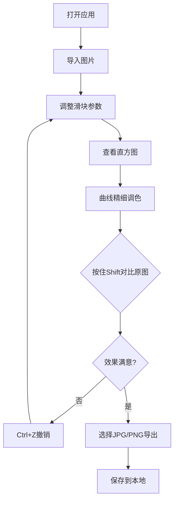

## 1. 产品概述

LuminaLab 是一款专业级浏览器端照片调色工具，无需安装，在 Chrome、Safari、Edge 浏览器中打开即可使用。专为摄影爱好者和设计师打造，提供专业级调色功能，操作流畅无卡顿。

- 核心价值：将专业级照片后期调色能力带到浏览器中，零门槛、轻量级、无需安装
- 目标用户：摄影爱好者、设计师、内容创作者
- 市场定位：轻量级、高性能、专业级的在线照片调色解决方案

## 2. 核心功能

### 2.1 用户角色
无需注册登录，所有用户直接使用全部功能。

| 角色 | 核心权限 |
|------|----------|
| 普通用户 | 图片导入、全部调色功能、原图对比、撤销重做、图片导出 |

### 2.2 功能模块
1. **调色工作台主页面**：滑块控制区、直方图显示区、曲线工具区、图片预览区

### 2.3 页面详情
| 页面名称 | 模块名称 | 功能描述 |
|---------|----------|----------|
| 调色工作台 | 左侧滑块控制区 | 6个专业调色滑块：亮度、曝光度、对比度、色温、饱和度、自然饱和度 |
| 调色工作台 | 右上直方图区域 | 实时波动直方图，显示RGB通道分布，死白死黑溢出时闪红三角警告 |
| 调色工作台 | 右下曲线工具 | 可拖拽控制点的曲线工具，支持RGB分别调节，内置S型、胶片预设 |
| 调色工作台 | 中央预览区 | 实时显示修图效果，按住Shift切换原图对比 |
| 调色工作台 | 全局操作 | 图片拖拽导入、Ctrl+Z撤销（最多20步）、导出JPG/PNG |

## 3. 核心流程

### 3.1 完整用户流程
用户打开应用 → 拖拽或点击导入图片 → 调整左侧滑块观察效果 → 查看直方图判断曝光 → 使用曲线工具精细调色 → 按住Shift对比原图 → 若操作失误按Ctrl+Z撤回 → 满意后选择格式导出保存。

## 4. 用户界面设计

### 4.1 设计风格
- **主色调**：深炭灰背景 (#0f0f10)，专业暗色调，符合专业修图软件标准
- **强调色**：渐变紫色 (#7c3aed → #a855f7) 用于滑块和交互元素，营造专业感
- **辅助色**：警示红 (#ef4444) 用于直方图溢出警告，通道色红 (#ef4444)、绿 (#22c55e)、蓝 (#3b82f6)
- **字体**：显示字体使用具有科技感的 "Space Grotesk"，正文使用 "Inter" 保证可读性
- **控件风格**：极简工业风，滑块采用细轨道+发光手柄，按钮采用微玻璃拟态，边角圆润 (8px)
- **布局**：三栏式专业布局，左侧280px控制区，中间自适应预览区，右侧320px专业工具区

### 4.2 页面设计概述
| 页面名称 | 模块名称 | UI元素 |
|---------|----------|--------|
| 调色工作台 | 顶部工具栏 | 导入按钮、导出按钮(JPG/PNG)、撤销按钮、重做按钮、重置按钮 |
| 调色工作台 | 左侧滑块区 | 6个带数值显示的专业滑块，每个滑块有图标、标签、实时数值 |
| 调色工作台 | 中央预览区 | 带网格背景的图片显示区，支持拖拽导入，底部显示文件信息 |
| 调色工作台 | 右上直方图 | 动态绘制的RGB三色直方图，左右两侧溢出警告三角，底部0-255刻度 |
| 调色工作台 | 右下曲线工具 | 带网格的曲线画布，RGB通道切换按钮，预设按钮(S型/胶片/重置) |

### 4.3 响应式
桌面端优先设计，核心功能区固定宽度确保专业操作体验；窗口缩小时中央预览区自适应调整，保证专业工具区完整显示。支持触摸设备操作。

### 4.4 动效与交互
- 滑块手柄悬停和拖动时发光效果
- 直方图数据平滑过渡动画
- 曲线控制点拖拽时的磁吸反馈
- 按钮点击的微缩放反馈
- 切换原图/效果图的淡入淡出过渡
- 直方图溢出时警告三角的闪烁动画
