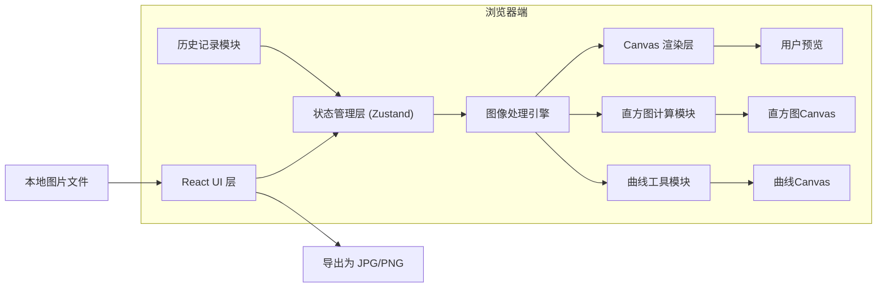

## 1. 架构设计

这是一个纯前端应用，所有图像处理逻辑在浏览器端通过 Canvas API 完成，无需后端服务。



## 2. 技术描述

- **前端框架**: React 18 + TypeScript + Vite
- **状态管理**: Zustand
- **样式方案**: Tailwind CSS 3
- **核心技术**: HTML5 Canvas API（图像处理、直方图绘制、曲线绘制）
- **图标库**: lucide-react
- **浏览器兼容**: Chrome (最新版)、Safari (最新版)、Edge (最新版)

### 核心技术选型理由
1. **Canvas API**: 原生浏览器API，像素级操作性能优异，无需额外依赖
2. **Zustand**: 轻量级状态管理，配合 Immer 实现历史记录撤销/重做
3. **React 18**: 并发渲染特性保证滑块拖拽时的流畅响应
4. **Vite**: 极速开发体验，构建产物轻量

## 3. 项目结构

```
src/
├── components/
│   ├── Toolbar.tsx          # 顶部工具栏 (导入/导出/撤销/重置)
│   ├── SliderPanel.tsx      # 左侧滑块控制面板
│   ├── AdjustmentSlider.tsx # 单个滑块组件
│   ├── PreviewArea.tsx      # 中央图片预览区
│   ├── Histogram.tsx        # 直方图组件
│   ├── CurveTool.tsx        # 曲线工具组件
│   └── OverlayWarning.tsx   # 溢出警告三角
├── hooks/
│   ├── useImageProcessor.ts # 图像处理核心Hook
│   ├── useHistogram.ts      # 直方图计算Hook
│   ├── useHistory.ts        # 历史记录Hook (撤销/重做)
│   └── useCurve.ts          # 曲线计算Hook
├── store/
│   └── useEditorStore.ts    # 全局状态管理
├── utils/
│   ├── imageProcessing.ts   # 图像处理算法
│   ├── colorMath.ts         # 色彩数学运算
│   ├── curveUtils.ts        # 曲线工具函数
│   └── exportUtils.ts       # 导出工具函数
├── types/
│   └── index.ts             # TypeScript 类型定义
├── App.tsx
├── main.tsx
└── index.css
```

## 4. 核心数据结构与类型

### 4.1 调整参数类型
```typescript
interface AdjustmentParams {
  brightness: number;        // -100 ~ 100
  exposure: number;          // -100 ~ 100
  contrast: number;          // -100 ~ 100
  temperature: number;       // -100 ~ 100 (冷->暖)
  saturation: number;        // -100 ~ 100
  vibrance: number;          // -100 ~ 100 (自然饱和度)
}

interface CurvePoints {
  rgb: Point[];              // 综合通道曲线点
  r: Point[];                // 红色通道曲线点
  g: Point[];                // 绿色通道曲线点
  b: Point[];                // 蓝色通道曲线点
}

interface Point {
  x: number;                 // 0 ~ 255
  y: number;                 // 0 ~ 255
}

type CurveChannel = 'rgb' | 'r' | 'g' | 'b';

interface HistogramData {
  r: number[];               // 256个值
  g: number[];               // 256个值
  b: number[];               // 256个值
  shadowsClipping: number;   // 死黑像素数
  highlightsClipping: number;// 死白像素数
}
```

### 4.2 预设定义
```typescript
interface CurvePreset {
  name: string;
  points: CurvePoints;
}

const CURVE_PRESETS: Record<string, CurvePreset> = {
  neutral: { /* 45度斜线 */ },
  sCurve: { /* S型对比度曲线 */ },
  film: { /* 胶片风格曲线 */ },
}
```

## 5. 图像处理算法

### 5.1 亮度调整 (Brightness)
对每个像素的 RGB 通道同时增减固定值，保持色彩比例不变。

### 5.2 曝光度调整 (Exposure)
模拟相机进光量，使用乘法因子调整，高光区域变化更明显。

### 5.3 对比度调整 (Contrast)
以 128 灰度为中心点，将像素值向两端拉伸或压缩。

### 5.4 色温调整 (Temperature)
调整 R/B 通道比例，增加R减B为暖调，减R加B为冷调。

### 5.5 饱和度调整 (Saturation)
基于 HSL 色彩空间，等比例调整所有颜色的饱和度。

### 5.6 自然饱和度 (Vibrance)
智能饱和度调整：对低饱和度区域增幅较大，保护肤色区域，防止高饱和度区域溢出。核心算法：
1. 计算像素饱和度 S
2. 计算保护因子：S 越高，保护因子越大，调整幅度越小
3. 检测肤色区域（R>G>B 且 R值较高），额外增加保护
4. 应用调整量

### 5.7 曲线调整
基于分段线性插值，对每个输入值 x 计算输出值 y。预先计算 256 阶查找表(LUT)，优化性能。

## 6. 性能优化策略

1. **查找表(LUT)缓存**: 所有调色参数变化时先计算 256x3 的 LUT，再批量应用到像素，避免逐像素重复计算
2. **防抖处理**: 滑块快速拖动时使用 requestAnimationFrame 合并渲染，每帧最多渲染一次
3. **离屏Canvas**: 直方图和曲线计算在 OffscreenCanvas 中完成，不阻塞主线程
4. **增量更新**: 仅当参数实际变化时才重新计算 LUT 和渲染
5. **像素数据复用**: 原图像素数据缓存，每次调整基于原图计算，避免累积误差

## 7. 历史记录实现

使用 Zustand + Immer 实现撤销/重做：
- 历史栈最大容量：20 步
- 每次参数变化（滑块释放、曲线编辑完成）时记录快照
- Ctrl+Z 触发撤销，Ctrl+Shift+Z 触发重做
- 记录内容：AdjustmentParams + CurvePoints

## 8. 图像处理流水线

```
原图像素数据 
    ↓
[亮度LUT] → [曝光LUT] → [对比度LUT] → [曲线LUT] → [色温LUT]
    ↓
应用到每个像素
    ↓
[饱和度调整] → [自然饱和度调整]
    ↓
输出像素数据 → 绘制到Canvas
    ↓
直方图计算
```
